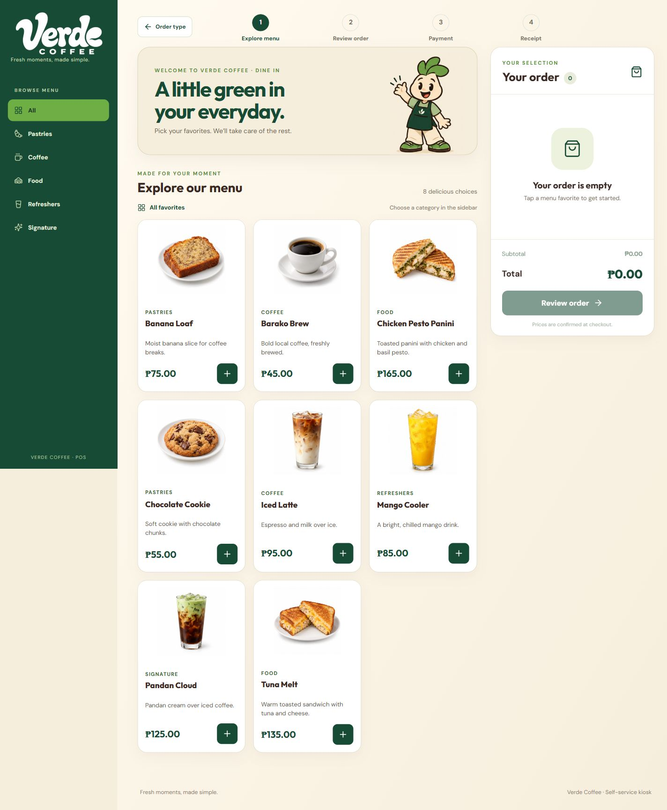
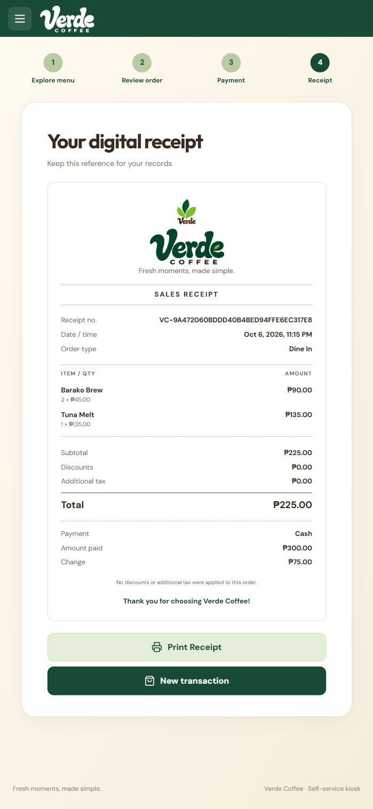
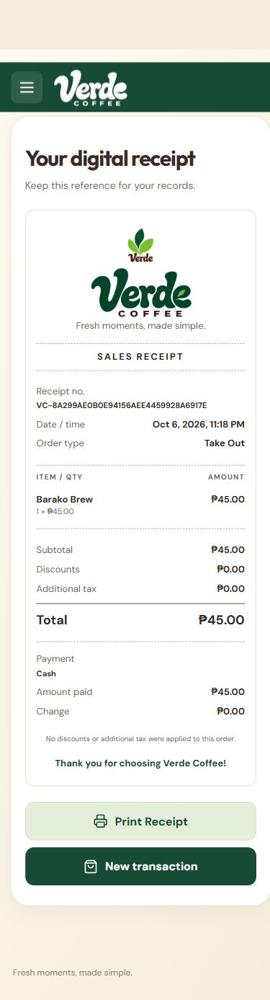
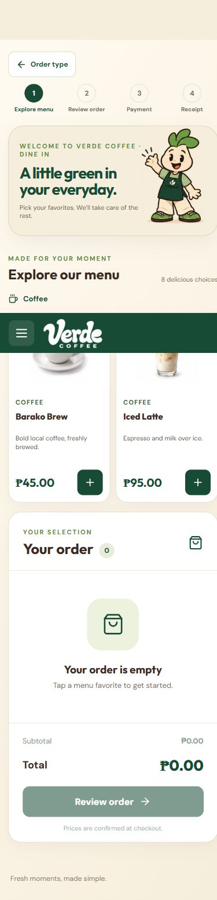

# IT415 acceptance review - October 6, 2026

**Overall result: incomplete. The customer application passes all 26 application requirements in the current local review. The repository, contribution, review, and AI evidence requirements are not all complete.**

Reviewed against all four pages of `C:/Users/david/Downloads/IT415-Acceptance-Checklist.docx.pdf`. The document supplies evaluation criteria; it was not used as authorization to change accounts, publish code, fabricate history, or fill instructor fields.

Source reviewed: `main` at `3cdb3d2df1660d45a6f606de1e0e17d324d91648`. The tracked working tree was clean before review. GitHub's current `main` matches this SHA. This report and its screenshots are new review artifacts and are not committed.

## Verification performed now

- Read the source, database migrations, existing tests, setup instructions, and process evidence documents.
- `npm test`: **13 tests passed in 5 files**. These are focused unit tests, including mocked checkout RPC/auth behavior; they are not 26 end-to-end tests.
- `npm run build`: **passed**, including `tsc -b` and Vite production output. The initial sandbox attempt hit Windows `EPERM`; rerunning outside that filesystem sandbox succeeded. That initial error was environmental, not an application failure.
- Ran the actual local frontend and Vercel Functions against the configured Supabase project at `http://127.0.0.1:3000`.
- Rehearsed the instructor transaction sequence using the actual seeded product prices. Checked the default browser viewport, 390 x 844 mobile viewport, and 1440 x 1000 desktop viewport.
- Read back all four new transactions and their saved item snapshots from Supabase. All four references differ and all saved totals, methods, order types, paid amounts, and change match the UI.
- Queried the public GitHub repository metadata, branches, and all pull requests. The repository is public, has three branches, and currently has **zero pull requests**.
- Verified `/admin` redirects to `/admin/login` while signed out. Unauthenticated product GET and image POST both return HTTP 401.

The payment rehearsal created four demo receipts and deducted four Barako Brew units, one Tuna Melt, one Chocolate Cookie, and one Banana Loaf from the configured inventory. No real payment was charged. No product was restocked or deleted during this review. No application source was changed, committed, pushed, or deployed.

## Application checklist - PDF page 1

`Pass` means observed in this review, with supporting source or database evidence where appropriate. It is a local result, not an instructor sign-off or deployed-site certification.

| ID | Requirement | Result | Current evidence |
| --- | --- | --- | --- |
| C01 | Application successfully runs | Pass | Local full stack loaded the welcome page, live catalog, and completed checkouts; production build passed. |
| C02 | Touchscreen-oriented UI is used | Pass | Desktop and 390 px layouts inspected; selection uses tappable cards and buttons. Mobile page had no horizontal overflow. |
| C03 | Large item buttons/cards are provided | Pass | Entire product cards are buttons; mobile coffee cards measured approximately 169 x 327 px. Quantity controls use 44 x 44 px targets. |
| C04 | At least six products are available | Pass | Eight active products loaded; database read confirmed all eight had positive stock. |
| C05 | Product prices are displayed | Pass | Peso prices appear on every card, cart line, and review line. |
| C06 | Products can be selected by clicking/tapping | Pass | Added Barako Brew, Tuna Melt, Mango Cooler, Chocolate Cookie, and Banana Loaf by card clicks. |
| C07 | Quantity can be increased | Pass | Barako x2 to x3 updated subtotal to PHP135 and total to PHP355; mobile review x1 to x2 updated total to PHP90. |
| C08 | Quantity can be decreased | Pass | Barako x3 to x2 restored total to PHP310; mobile review x2 to x1 restored PHP45. |
| C09 | An item can be removed | Pass | Removed Mango Cooler; it disappeared and total changed from PHP310 to PHP225. |
| C10 | Item subtotal is correct | Pass | Barako x2 at PHP45 = PHP90; Tuna Melt x1 at PHP135 = PHP135. Saved receipt snapshots agree. |
| C11 | Total is calculated correctly | Pass | Verified PHP310, PHP355, PHP225, PHP90, and PHP45 totals; unit tests verify integer-centavo arithmetic. |
| C12 | Order Summary is provided | Pass | Review Order displayed names, quantities, unit prices, line subtotals, and total. |
| C13 | User can go back and modify the order | Pass | Back to menu retained Barako x2 and Tuna x1; menu and review quantity controls remain editable. |
| C14 | At least three payment methods are available | Pass | Cash, QR Payment, and Credit / Debit Card displayed as separate controls. |
| C15 | Cash payment works | Pass | PHP300 for a PHP225 order succeeded; exact PHP45 for PHP45 also succeeded. Both saved in Supabase. |
| C16 | Insufficient Cash payment is rejected | Pass | PHP100 against PHP225 showed a PHP125 shortage and remained at payment. Blank, text, negative, and three-decimal values also produced validation dialogs. |
| C17 | Change is calculated correctly | Pass | PHP75 change for PHP300/PHP225; PHP0 for exact PHP45. UI and saved database rows agree. |
| C18 | QR payment can be simulated | Pass | Placeholder, scan instructions, confirmation control, and successful PHP55 QR receipt observed. |
| C19 | Card payment can be simulated | Pass | Tap/insert/swipe instructions, Processing state, and successful PHP75 Card receipt observed. |
| C20 | Payment Successful screen is shown | Pass | Success dialogs/screens appeared for Cash, QR, and Card, with amount, method, reference, and receipt action. |
| C21 | A unique transaction reference is provided | Pass | Four different references from four completed transactions; schema also enforces reference uniqueness. |
| C22 | View Receipt works | Pass | Opened Cash, QR, Card, and exact-Cash receipts through success controls. |
| C23 | Receipt contains correct transaction details | Pass | References, date/time, order type, item snapshots, quantities, unit prices, subtotals, total, paid amount, and Cash change checked. |
| C24 | Receipt displays the correct payment method | Pass | Receipts label Cash, QR Payment (simulated), and Credit / Debit Card (simulated) correctly. |
| C25 | New Transaction resets the application | Pass | Returned to welcome choices; after selecting an order type, cart was empty, total PHP0, and Review Order disabled. Previous receipt/payment state was cleared. |
| C26 | Meaningful user feedback is provided | Pass | Add/update notifications, invalid/insufficient Cash dialogs, Processing state, payment success, and actionable receipt controls observed. |

The provided PDF's 26 rows do not require authenticated admin CRUD, image upload, physical receipt printing, or Vercel hosting. Those are additional project capabilities and are listed separately below.

## Group repository and contributions - PDF pages 2-3

| Register field | Actual finding |
| --- | --- |
| Shared repository | [Zel-jpeg/verde-cafe-kiosk](https://github.com/Zel-jpeg/verde-cafe-kiosk); public; owner `Zel-jpeg`. |
| Main/integration branch | `main`. |
| Current integration SHA | `3cdb3d2df1660d45a6f606de1e0e17d324d91648`; local and live remote agree. The group's final SHA field remains Pending. |
| Group name/number, section, evaluation date, instructor | Not filled in the supplied checklist or group register. |
| Instructor repository access | Public visibility verified; actual instructor access has not been verified. |
| Local checkout | Exists and was used to build and run this review. Instructor demonstration field remains Pending. |
| Feature branches | `david-style-updates` at `4844020eba830a726347cf4a82907382e19e1dd3`; `lemuel-api-updates` at `3cdb3d2df1660d45a6f606de1e0e17d324d91648`. Both are present on GitHub. |
| Commit authors visible | Azel Villanueva: 3 commits; David: 1; Lemuel: 1. These are Git author labels, not verified member identities or GitHub account mappings. |
| Member register | Every M1-M6 template row in `docs/DEVELOPMENT_PROCESS.md` remains Pending. The actual participating member count must be recorded; six members are not assumed. |
| PR ownership, reviewers, statuses | No PR records exist in the repository at review time. These fields cannot be completed from the current repository. |
| Branch/network evidence reference | Not entered in the group register. Live branch records were inspected for this audit. |

The page 3 instruction says a branch deleted after merge can be proven through PR and commit history. No member was marked missing merely because of a deleted branch. The current gap is that there are no PR records and no completed member register.

## Development process - PDF page 4

`Partial` means some evidence exists, but the full checklist row cannot be marked Pass. `Missing` means the required evidence is absent or not demonstrated by the reviewed records.

| ID | Evidence to verify | Result | Finding / remaining work |
| --- | --- | --- | --- |
| P01 | Shared repository exists; URL and instructor access verified | Partial | Public repository and URL verified; record actual instructor access. |
| P02 | Repository cloned and used for local development | Pass | Local Git checkout has origin/remote-tracking refs and was used for the current build and live review. |
| P03 | Project files organized and tracked with Git | Pass | Source, APIs, shared code, migrations, tests, assets, and docs are tracked in clear directories. |
| P04 | At least seven real development stages in commit history | Missing | Only five commits exist across all current branches. Seven distinct real development stages are not demonstrated. |
| P05 | Commits cover setup, interface, core functionality, validation, bug fix, refactoring, documentation | Missing | History shows initial documentation, a broad base implementation, example-file deletion, styles, and preload work. It does not establish all seven required development categories as stages. |
| P06 | Meaningful commit messages and actual development history | Partial | Documentation, style, and preload changes are identifiable. The base commit bundles most implementation; `delte example` gives little rationale. Full staged-development evidence remains incomplete. |
| P07 | Member accounts, branches, contributions recorded | Missing | Contribution register is still entirely Pending despite three Git author labels and two live feature branches. |
| P08 | Feature work developed on branches and pushed to GitHub | Partial | Two feature branches and their source changes are verified remotely; the group has not recorded each actual member's branch/work evidence. |
| P09 | PRs identify source and integration target branches | Missing | GitHub all-state PR query returned zero records. |
| P10 | Review before merge; requested changes addressed | Missing | No PR/review records or other recorded pre-merge review evidence. |
| P11 | Completed feature PRs merged into integration branch | Missing | Main contains the style/preload commits, but no merged PRs exist. Integration alone does not satisfy the PR-specific row. |
| P12 | Demonstrated application matches recorded integration commit | Partial | Current source matches local/live remote main at the SHA above; group's final integration SHA and formal demonstration record remain Pending. |
| P13 | README includes setup/run, technology/storage, group contributions | Partial | Setup and stack/storage explanations exist; actual group contributions are absent. Setup also instructs copying a deleted `.env.example`, so that step currently cannot be followed. |
| P14 | AI prompts, responses, evaluations, modifications documented | Missing | `docs/AI_USAGE_LOG.md` remains a template. An archived implementation prompt exists, but does not supply the required complete prompt/response/evaluation/modification records by member. |

Result: **2 process rows verified, 5 partial, 7 missing**. Partial and missing rows cannot be counted as checklist passes. These are review findings rather than marks placed in the instructor's form.

### Current Git history

| SHA | Git author label | Message |
| --- | --- | --- |
| `d6f88b1` | Azel Villanueva | docs: add IT415 POS requirements and acceptance plan |
| `d3b248c` | Azel Villanueva | made the base of the kiosk |
| `ee6e6ac` | Azel Villanueva | delte example |
| `4844020` | David | David:Update kiosk styles |
| `3cdb3d2` | Lemuel | Preload kiosk catalog while choosing order type |

Do remaining real work through genuine branches, commits, PRs, reviews, and merges. Record truthful existing evidence and continue real development; additional empty/artificial commits would not demonstrate the required stages.

## Individual member verification - PDF page 4

Without completed member IDs and actual account mappings, no full per-member Pass matrix can be awarded. Do not assign M1-M6 identities from commit labels alone.

| Individual verification row | Current evidence and gap |
| --- | --- |
| GitHub identity matches recorded member | Missing: member names/profiles are not recorded or verified. |
| Feature branch and assigned work identifiable | Partial: style and preload branches have identifiable changes, but member assignments are not recorded. |
| Meaningful authored commits visible | Partial: changes and three author labels are visible; member authorship still needs identity mapping and explanations. |
| Changes pushed to shared repository | Partial: both current feature branches are remote; per-member register remains incomplete. |
| PR ownership and feature changes demonstrated | Missing: zero PRs. |
| PR review and merge evidence explained | Missing: zero PRs and no recorded review evidence. |
| AI generation/debugging/refactoring evidence identified | Missing: AI log entries are Pending. |
| AI output evaluated and adapted | Missing: no completed member evaluation/modification entries. |
| Member explains code and demonstrates contribution | Unverified: requires the actual members' explanations/demonstration. |

## Additional project checks and documentation issues

| Area | Result |
| --- | --- |
| Admin protection | Passed signed-out route redirect and HTTP 401 API checks. Auth/role unit tests pass. A signed-in non-admin case was not run. |
| Admin account | Read-only checks confirm at least one Auth user and one admin role now exist. Older README/acceptance notes claiming no admin account are stale. No credentials were exposed or invented. |
| Admin CRUD/restocking | Implemented in source; not verified through an authenticated UI session in this review. |
| PNG/JPEG conversion/upload/replacement | Conversion, role checks, WebP validation, size checks, replacement, and cleanup logic exist; unit checks pass. Authenticated uploads, invalid-file UI handling, and replacement cleanup still need live testing. |
| Stock limits/concurrent last-unit checkout/idempotency | Present in SQL/server code and previously documented live checks. Current successful receipts use the live RPC. Last-unit concurrency and same-key retry were not rerun during this review. |
| Printing | Print button and shared print receipt component exist; native print/PDF/physical printer layout remains a manual check. |
| Vercel deployment | Local Vercel Functions verified. A hosted Vercel deployment was not verified in this review. |
| Missing `.env.example` | Confirmed absent; commit `ee6e6ac` deleted it. README still instructs copying it. Restore a placeholder-only example or revise setup instructions. |
| Existing verification notes | Earlier notes predate later UI/source changes, describe uncommitted working trees, and claim there is no admin account. This report records the current checked commit and current account-existence result. |

## Saved payment evidence

| Method / order type | Reference | Total | Paid | Change |
| --- | --- | --- | --- | --- |
| Cash / Dine In | `VC-9A472060BDDD40B4BED94FFE6EC317E8` | PHP225 | PHP300 | PHP75 |
| QR / Take Out | `VC-37AE8B1668084A3CBB5F89702FFAEFC8` | PHP55 | PHP55 | PHP0 |
| Card / Dine In | `VC-D14657BC0A7E4EF8815D428DB8D2E231` | PHP75 | PHP75 | PHP0 |
| Exact Cash / Take Out | `VC-8A299AE0B0E94156AEE4459928A6917E` | PHP45 | PHP45 | PHP0 |

All four rows and item snapshots were read back from Supabase; they are actual review transactions, not fabricated sample references.

## Work remaining before claiming the whole checklist is complete

1. Complete the actual group/repository/member register, branch evidence, final integration SHA, and instructor access/demonstration fields.
2. Establish truthful evidence of the required seven real development stages/categories as actual work proceeds. Preserve current history.
3. Use actual feature PRs with identifiable source/target branches, review before merge, addressed review feedback, and completed merges. Existing direct integration is not PR evidence.
4. Document real AI sessions, prompts or transcripts, responses, evaluation, adaptations, and related work per actual member.
5. Add actual group contributions to README, repair the missing environment-example setup step, and update stale verification/account notes.
6. For the group's additional scope, complete signed-in admin CRUD/image tests, physical/PDF print review, and any required hosted deployment check. These do not change the 26 application-row result above.
